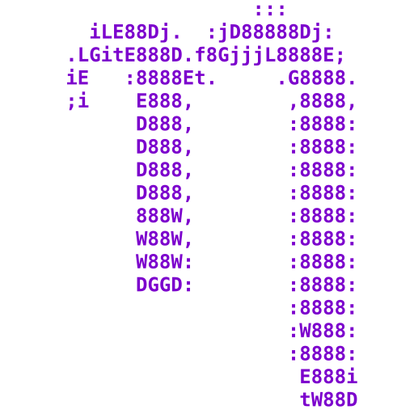

# Nano for Legacy Windows 

This is a ported, standalone build of [GNU Nano](https://www.nano-editor.org/) for
legacy Windows — running all the way down to **Windows NT 4.0** (NT 4.0, 2000, XP,
Server 2003, Vista, and 7)! It can also build static Linux binaries.

## About

Nano is a famous, easy-to-use and handy commandline text editor, traditionally for UNIX/Linux systems.  

The main Win32 support code (in [this patch](./patches/nano/nano-win32.patch)) is based on [this repo](https://github.com/lhmouse/nano-win),
but unlike that repo, which uses an entire patched nano source tree, this repo prefers using
separated patch files and downloading + patching sources, which is also needed
for patching [ncurses](https://invisible-island.net/ncurses/) for Windows NT 4.0+ support.  

<table>
  <tr>
    <td align="center" valign="middle"></td>
    <td align="center" valign="middle"></td>
    <td align="center" valign="middle"></td>
  </tr>
</table>

## Downloads

The latest CI build can be found in releases [Here](https://github.com/Alex313031/nano/releases/tag/CI-Build),  
otherwise, grab the latest stable release [Here](https://github.com/Alex313031/nano/releases/latest).

## Building

I use [my MinGW fork](https://github.com/Alex313031/mingw-build#readme) to compile the releases.  
There are GitHub runner [CI builds](./.github/workflows/all.yml) that use this toolchain too.

This repo consists of a [build script](./build_nano.sh) and [collection of patches](./patches/).  
The [assets](./assets) dir contains images and text files for readmes or packaging.

The script downloads sources to `_build/src/` (a separate patched tree per OS, so Windows
and Linux builds don't clash), and builds nano + ncurses in a per-OS/arch dir under
`_build/build/` (e.g. `win_x86`, `linux_x64`). Finally, it puts the finished
executable or .zip (if applicable) into `out/`.

```bash
 ./build_nano.sh x86 # Make Windows 32 bit build

 ./build_nano.sh x64 # Make Windows 64 bit build

 ./build_nano.sh x86 x64 # Make both 32 and 64 bit builds

 ./build_nano.sh x64 --linux # Make a static 64 bit Linux build

 ./build_nano.sh x86 --package # Build, then package the .exe into a .zip

 ./build_nano.sh x86 --debug # Make a debug build (unstripped)

 ./build_nano.sh x86 --verbose # Show verbose build output

 ./build_nano.sh x86 --jobs 8 # Build using 8 make jobs

 ./build_nano.sh x86 --clean # Clean source and output dirs

 ./build_nano.sh --deps # Install build prerequisites (Debian/Ubuntu)

 ./build_nano.sh --version # Show script version

 ./build_nano.sh --help # See all build options
```

## License
This repo is licensed under the [GPL-3 License](./LICENSE.md), as is the original nano.
